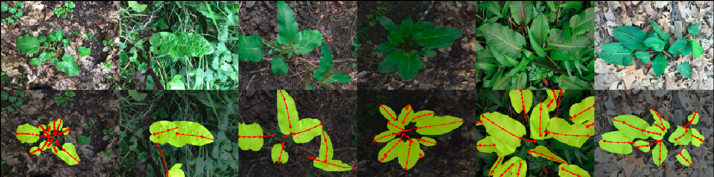
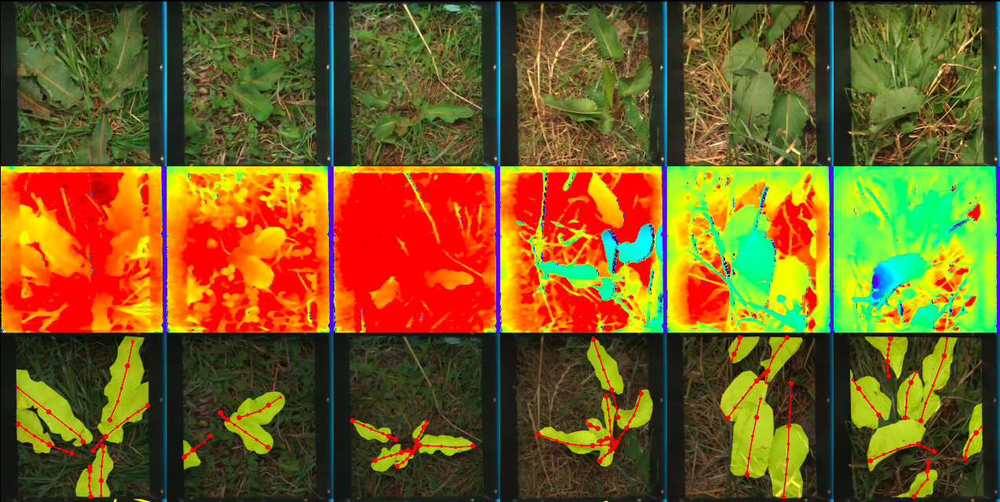

# RumexLeaves: Dataset introduced by Paper "Fine-grained Leaf Analysis for Efficient Weeding Robots"
## Useful Links:
* [RumexLeaves Website](https://dtu-pas.github.io/RumexLeaves/)
* [Publication](ToDo)
* [Dataset](ToDo)

## Overview:
RumexLeaves contains in total 809 images with 7747 annotations of Rumex obtusifolius leaves. For each leaf, a pixel-wise leaf blade annotation as well as a polyline annotation of the stem - if visible - and vein were manually created. The stem is visible for ~ 45% of the leaves. We differentiate between two variants of datapoints: (1) iNaturalist datapoints that have been downloaded from the plant publisher iNaturalist and (2) RoboRumex datapoints collected with an agriculture robotics platform. Both variants originate from real-world settings.

|                | Total | iNaturalist | RoboRumex |
|----------------|-------|-------------|-----------|
| # Images         | 809     | 690           | 119         |
| # Leaves w stem  | 3460     | 3250           | 210         |
| # Leaves wo stem | 4287     | 3916           | 371         |


## Example Images
### iNaturalist Samples
<p float="left">
  
</p>

### RoboRumex Samples
<p float="left">
   
</p>

## Getting started: Pytorch Dataset Class
Download data
```
wget ToDO
```
Install dependencies
```
pip install -r requirements.txt
```
The Pytorch Datasets allows an easy entrypoint to work with the dataset.
To visualize some example images, please run.
```
python rumex_leaves/visualize_img_data.py --data_folder <path-to-your-extracted-RumexLeaves-folder> --num_images <number-of-images-to-display> --datapoint_type <iNaturalist/RoboRumex>
```


## Citation

If you find this work useful in your research, please cite:
```
@article{fine_grained_2023,
author = {Güldenring, Ronja and Anderse, Rasmus Eckholdt and Nalpantidis, Lazaros},
title = {Fine-grained Leaf Analysis for Efficient Weeding Robots},
journal = {tba},
year = {2023}
}
```